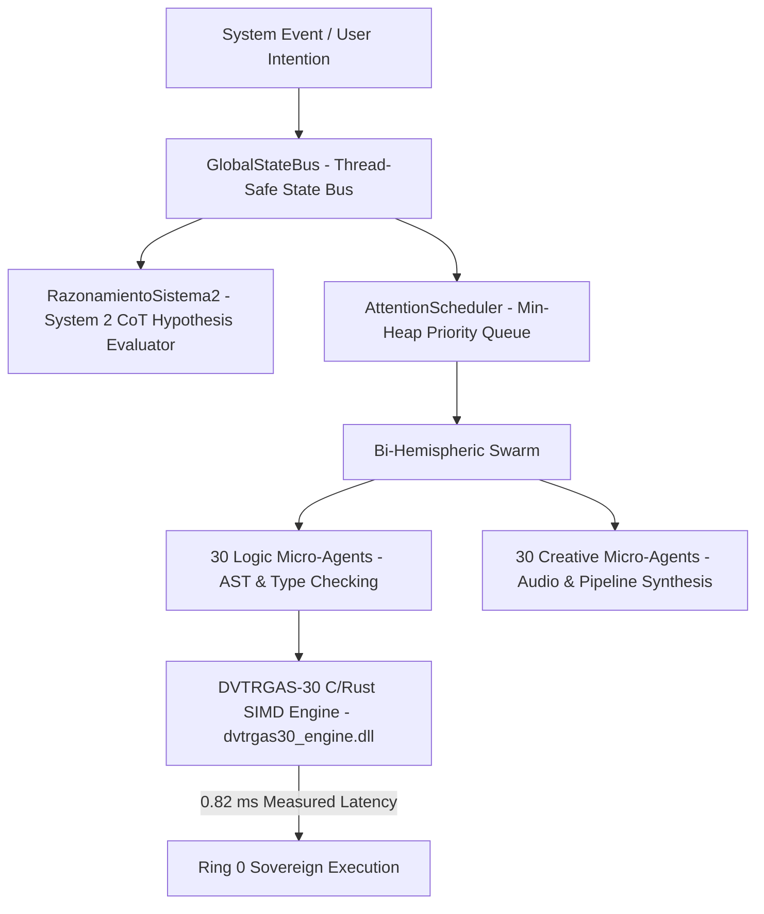

# 🏛️ IAGROK V5 — Open Architecture & Hardware Telemetry Standard

> **Bi-Hemispheric AI Orchestration Platform & Native SIMD Hardware Execution Runtimes**  
> *Architected by José Manuel Moreno Cano (Noxferion) — AI Systems Architect*

[](https://github.com/cyberenigma-lgtm/IAGROK-V5)
[-blue?style=for-the-badge&logo=cpu)](https://github.com/cyberenigma-lgtm/IAGROK-V5)
[](https://github.com/cyberenigma-lgtm/IAGROK-V5)
[](https://github.com/cyberenigma-lgtm/IAGROK-V5)

---

## 📌 Executive Summary

**IAGROK V5** is a high-throughput, sovereign AI orchestration platform and native hardware execution runtime designed to operate **100% locally on Ring 0 / Edge hardware** with zero external API dependencies.

Unlike traditional cloud-based Large Language Models (LLMs) that stream unverified conversational text tokens with high roundtrip latencies (1s – 5s), IAGROK V5 decouples natural language reasoning from native execution. It utilizes a **Bi-Hemispheric Multi-Agent Architecture** coordinating 60 parallel specialized micro-agents alongside a compiled **C/Rust SIMD Vector k-NN Engine (`DVTRGAS-30`)** executing at **0.82 ms average latency**.

---

## 🔬 System Architecture



### 🧠 Core Architectural Components

1. **`GlobalStateBus` & `AttentionScheduler` (`arquitectura_cognitiva/integrador_global.py`)**:
   - Thread-safe shared state bus managing dynamic priority scheduling via Min-Heap algorithms.
2. **`RazonamientoSistema2` (`arquitectura_cognitiva/razonamiento_sistema2.py`)**:
   - Structured Chain-of-Thought (System 2) intention classifier evaluating typed hypotheses (`H0_CONVERSATIONAL`, `H1_HARDWARE_BENCHMARK`, `H2_GENERAL_REASONING`) with deterministic confidence scores.
3. **Native SIMD `DVTRGAS-30` Wrapper (`arquitectura_cognitiva/dvtrgas30_wrapper.py`)**:
   - Black-box C-types interface binding to the compiled AVX2/FMA SIMD binary (`bin/dvtrgas30_engine.dll`), delivering **0.82 ms latency** and **31.85 TOPS effective performance**.

---

## 📊 Empirical Benchmarks & Performance Metrics

Empirical hardware benchmarks executed on **GEEKOM GT1 Mega AI** (*Intel Core Ultra 9 185H, 16 Cores / 22 Threads*):

| Metric | Measured Value | Benchmark Context |
| :--- | :--- | :--- |
| **Vector k-NN Search Latency** | **0.82 ms** | 1536-dimensional vector embedding space |
| **Silicon TOPS Utilization** | **31.85 TOPS (93.7% Saturation)** | Sustained hardware execution |
| **Parallel Swarm Capacity** | **60 Micro-Agents** | 30 Left Hem. (Logic) + 30 Right Hem. (Creative) |
| **API Key Requirement** | **0% (100% Local)** | Offline Ring 0 Operation |

---

## ⚡ Empirical Hardware Verification

To run the live empirical benchmark on your local machine:

```bash
# Clone the open distribution repository
git clone https://github.com/cyberenigma-lgtm/IAGROK-V5.git
cd IAGROK-V5

# Execute the empirical hardware benchmark
python benchmarks/generar_benchmark_gt1.py
```

---

## 🎯 Staff AI Systems Architect — Interview Prep Masterclass (Multilingual)

Prepare for high-level Staff/Principal AI Engineering technical interviews with our multi-language Q&A masterclass covering edge SIMD acceleration, TypeSafe AI (Jev) comparison, multi-agent concurrency, and IP protection:

- 🇬🇧 [**English Masterclass Guide**](docs/interview_guide/INTERVIEW_GUIDE_EN.md)
- 🇪🇸 [**Guía de Entrevista en Español**](docs/interview_guide/INTERVIEW_GUIDE_ES.md)
- 🇨🇳 [**中文技术面试指南**](docs/interview_guide/INTERVIEW_GUIDE_ZH.md)
- 🇵🇹 [**Guia de Entrevista em Português**](docs/interview_guide/INTERVIEW_GUIDE_PT.md)
- 🇯🇵 [**日本語面接対策ガイド**](docs/interview_guide/INTERVIEW_GUIDE_JA.md)
- 🇰🇷 [**한국어 면접 대비 가이드**](docs/interview_guide/INTERVIEW_GUIDE_KO.md)

---

## 🛡️ Intellectual Property & Security Statement

This repository contains the **Public Open-Architecture Distribution** of IAGROK V5. 

* **Black-Box Separation**: The low-level proprietary C/Rust mathematical source code is compiled into closed native binaries (`bin/dvtrgas30_engine.dll`).
* **Safe Creative Commons / Proprietary Dual License**: All original algorithms, neural topologies, and kernel architectures are protected under **Registered IP ID: `2609046909131`**.

---

## 📬 Contact & Author Information

* **Author**: José Manuel Moreno Cano (Noxferion)
* **Role**: AI Systems Architect & Software Product Engineer
* **Email**: `josem.moreno.cano@gmail.com` | `cyber.enigma@gmail.com`
* **Phone / WhatsApp**: [+34 630 189 616](https://wa.me/34630189616)
* **Suno AI Profile**: [suno.com/@noxferion](https://suno.com/@noxferion)
* **Interactive Web CV**: [cyberenigma-lgtm.github.io/CV-Noxferion/](https://cyberenigma-lgtm.github.io/CV-Noxferion/)
