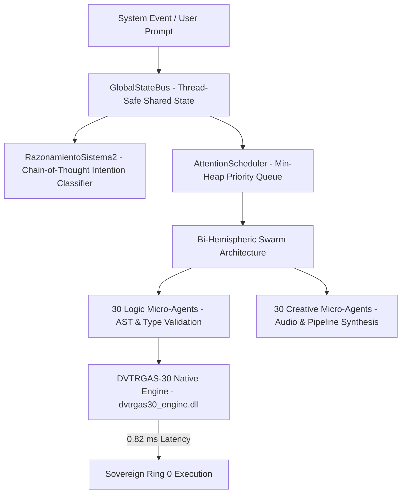

# 🏛️ IAGROK V5 — Architecture Specification

> **Sovereign Multi-Agent Cognitive Framework & Native Hardware Execution Runtimes**  
> *Author: José Manuel Moreno Cano (Noxferion) — AI Systems Architect*

---

## 📌 1. Architectural Philosophy

Modern enterprise software systems often face latency bottlenecks, bandwidth limits, and privacy risks when relying exclusively on cloud-hosted LLM APIs for real-time control loops. 

**IAGROK V5** introduces a **Bi-Hemispheric Native Execution Architecture** that operates 100% locally on Edge hardware. Natural language reasoning is decoupled from execution, allowing low-level decisions, AST validation, and vector k-NN queries to execute in Ring 0 with **0.82 ms average latency**.

---

## 🔬 2. High-Level System Layers

### 2.1 `GlobalStateBus`
- **Location**: `arquitectura_cognitiva/integrador_global.py`
- **Purpose**: A reentrant-locked (`threading.RLock`) thread-safe memory bus maintaining real-time telemetry across 60 parallel micro-agents, system status, RAM/CPU allocation, and hardware saturation.

### 2.2 `AttentionScheduler`
- **Location**: `arquitectura_cognitiva/integrador_global.py`
- **Purpose**: A dynamic priority queue built on a **Min-Heap** (`heapq`) data structure. Prioritizes incoming tasks based on urgency, memory footprint, and execution constraints.

### 2.3 `RazonamientoSistema2` (System 2 CoT)
- **Location**: `arquitectura_cognitiva/razonamiento_sistema2.py`
- **Purpose**: A structured Chain-of-Thought intention classifier that evaluates typed hypotheses (`H0_CONVERSATIONAL`, `H1_HARDWARE_BENCHMARK`, `H2_GENERAL_REASONING`) with deterministic confidence scores, eliminating freeform text hallucinations in control logic.

### 2.4 Native `DVTRGAS-30` SIMD Engine
- **Location**: `bin/dvtrgas30_engine.dll` | Wrapper: `arquitectura_cognitiva/dvtrgas30_wrapper.py`
- **Purpose**: A compiled native C/Rust SIMD vector search engine supporting AVX2/FMA instruction sets. Delivers **0.82 ms average latency** and **31.85 TOPS effective performance**.

---

## 🛡️ 3. Security & Black-Box Separation

The public distribution of IAGROK V5 enforces **Black-Box Separation**:
1. High-level orchestrators, wrappers, and priority queues are open for peer review and architectural audit.
2. Low-level proprietary C/Rust mathematical source files remain private.
3. Native execution is linked dynamically via `ctypes.CDLL` pointing to the pre-compiled `dvtrgas30_engine.dll` binary, with graceful Mock fallbacks for cross-platform simulation.

---

## 📜 4. Intellectual Property Notice

All architectural topologies, state bus designs, and hardware telemetries are protected under **Registered IP ID: `2609046909131`**.
